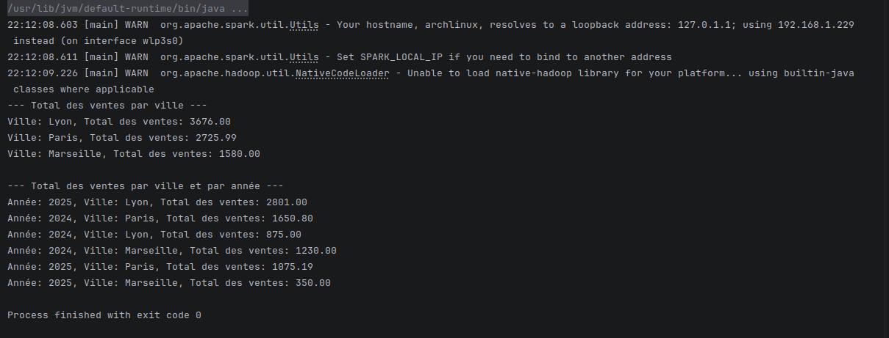
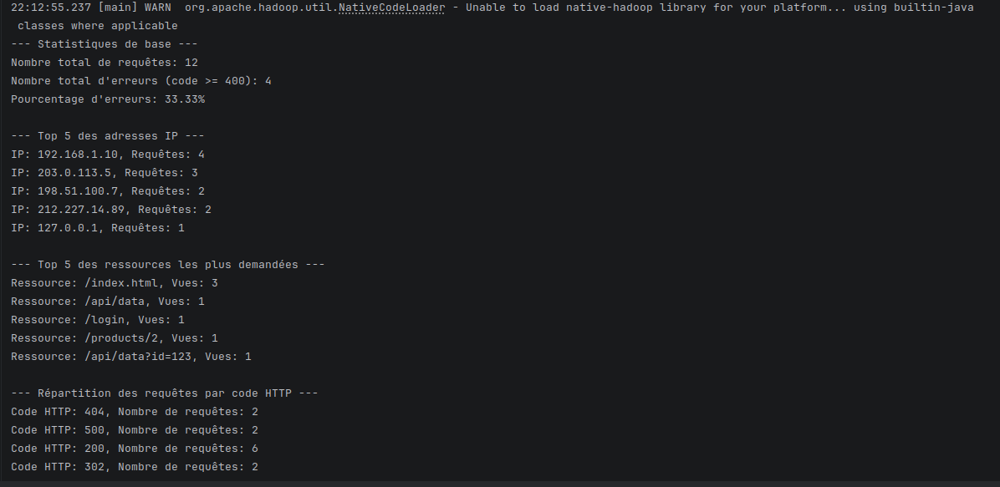

# TP1 — Data Analysis with Apache Spark (Java)

Author: Otmane TOUHAMI  
Course/Lab: TP1 Spark RDD in Java

This report fully documents the project, explains every part of the code step by step, and shows execution via screenshots.


## 1) Learning context and objectives
- Manipulate Spark RDDs in Java.
- Read text files from the local filesystem.
- Apply transformations (`map`, `mapToPair`, `filter`) and actions (`count`, `foreach`, `take`).
- Cache a reused RDD.
- Compute per-key aggregations with `reduceByKey`.
- Sort and select Top-N.
- Parse HTTP logs with a regular expression.


## 2) Prerequisites
- Java 21 (configured via Maven `maven.compiler.source/target=21`).
- Maven 3.8+.
- Internet access (to download Maven dependencies, and optionally via `spark-submit --packages`).
- Optional local Spark if you want to run with `spark-submit` (otherwise, IDE execution is recommended).


## 3) Project structure
```
.
├── config/                        # Environment variables for Hadoop/YARN containers (optional)
├── data/
│   ├── ventes.txt                 # Sales dataset (text)
│   └── access.log                 # Apache HTTP access log (text)
├── docker-compose.yaml            # Hadoop + Spark Standalone stack (optional)
├── pom.xml                        # Maven configuration (Spark Core 4.0.1, Scala 2.13)
├── screenshots/
│   ├── ex1-exec.png               # Screenshot Exercise 1 (successful run)
│   └── ex2-exec.png               # Screenshot Exercise 2 (successful run)
└── src/
    ├── main/java/ma/enset/
    │   ├── Exercice1.java         # Sales analysis by city and by year
    │   └── Exercice2.java         # HTTP log analysis (Top IPs, Top resources, HTTP codes)
    └── main/resources/
        ├── META-INF/MANIFEST.MF
        └── log4j2.properties      # Reduce logging verbosity (level WARN)
```


## 4) Datasets used
### 4.1 `data/ventes.txt`
Format (space-separated):
```
YYYY-MM-DD <City> <Product> <Price>
```
Samples:
```
2024-05-10 Paris Ordinateur 1200.50
2025-01-15 Paris Clavier 75.20
2025-01-20 Lyon Smartphone 900.25
```

### 4.2 `data/access.log`
Each line follows the common Apache log format (Common/Combined) and is parsed with a regular expression. Example:
```
127.0.0.1 - - [10/Oct/2024:13:55:36 +0000] "GET /index.html HTTP/1.1" 200 1043
```
Extracted fields: IP, date/time, HTTP method, resource, HTTP status code, response size.


## 5) Dependencies and configuration
- Main dependency: `org.apache.spark:spark-core_2.13:4.0.1`.
- `log4j2.properties`: sets `rootLogger.level=WARN` to reduce noise during runs.
- `docker-compose.yaml`: offers a local stack (Hadoop + Spark Standalone) to go further (optional for this lab).

Relevant `pom.xml` extract:
```xml
<properties>
  <maven.compiler.source>21</maven.compiler.source>
  <maven.compiler.target>21</maven.compiler.target>
  <spark.version>4.0.1</spark.version>
</properties>
<dependencies>
  <dependency>
    <groupId>org.apache.spark</groupId>
    <artifactId>spark-core_2.13</artifactId>
    <version>${spark.version}</version>
  </dependency>
</dependencies>
```


## 6) Code walkthrough — Exercise 1 (Sales analysis)
File: `src/main/java/ma/enset/Exercice1.java`

Goal: 
- Q1: Total sales per city.
- Q2: Total sales per city AND per year (composite key).

Main steps:
1. Spark configuration and context
   ```java
   SparkConf conf = new SparkConf().setAppName("Ventes RDD Analysis").setMaster("local[*]");
   JavaSparkContext sc = new JavaSparkContext(conf);
   ```
   - `local[*]`: runs locally using all available cores.

2. Read the text file
   ```java
   JavaRDD<String> lines = sc.textFile("data/ventes.txt");
   ```
   - Each line: "YYYY-MM-DD City Product Price".

3. Q1 — Total sales per city
   - Transform into pairs `(city, price)`:
     ```java
     JavaPairRDD<String, Double> ventesParVille = lines.mapToPair(line -> {
       String[] parts = line.split(" ");
       String ville = parts[1];
       double prix = Double.parseDouble(parts[3]);
       return new Tuple2<>(ville, prix);
     });
     ```
   - Aggregate by city:
     ```java
     JavaPairRDD<String, Double> totalParVille = ventesParVille.reduceByKey(Double::sum);
     ```
   - Print results:
     ```java
     totalParVille.foreach(data -> System.out.println(
       "City: " + data._1() + ", Total sales: " + String.format("%.2f", data._2())));
     ```

4. Q2 — Total per city and per year (composite key)
   - Transform to composite key `(year, city)`:
     ```java
     JavaPairRDD<Tuple2<String, String>, Double> ventesParAnneeVille = lines.mapToPair(line -> {
       String[] parts = line.split(" ");
       String annee = parts[0].substring(0, 4); // Extract year
       String ville = parts[1];
       double prix = Double.parseDouble(parts[3]);
       return new Tuple2<>(new Tuple2<>(annee, ville), prix);
     });
     ```
   - Aggregate and print:
     ```java
     JavaPairRDD<Tuple2<String, String>, Double> totalParAnneeVille = ventesParAnneeVille.reduceByKey(Double::sum);
     totalParAnneeVille.foreach(data -> System.out.println(
       "Year: " + data._1()._1() + ", City: " + data._1()._2() +
       ", Total sales: " + String.format("%.2f", data._2())));
     ```

5. Close the context
   ```java
   sc.close();
   ```

Good practices visible:
- Robust parsing with `Double.parseDouble` and `substring` for the year.
- Formatted prints.
- Use of `reduceByKey` (cluster-side aggregation, scalable).


## 7) Code walkthrough — Exercise 2 (HTTP log analysis)
File: `src/main/java/ma/enset/Exercice2.java`

Goal: 
- Analyze an `access.log` file to obtain statistics: total number of requests, error percentage, Top 5 IPs, Top 5 resources, distribution of HTTP status codes.

Main steps:
1. Define the parser (regex) and data model
   ```java
   private static final String LOG_REGEX =
     "^(\\S+) (\\S+) (\\S+) \\([\\w:/]+\\s[+\\-]\\d{4}\\) \"(\\S+) (\\S+) (\\S+)\" (\\d{3}) (\\d+)";
   private static final Pattern PATTERN = Pattern.compile(LOG_REGEX);

   public static class LogEntry implements Serializable {
     String ip; String dateTime; String method; String resource; int httpCode; long responseSize;
     public static LogEntry parse(String logLine) {
       Matcher matcher = PATTERN.matcher(logLine);
       if (matcher.find()) {
         return new LogEntry(
           matcher.group(1), matcher.group(4), matcher.group(5), matcher.group(6),
           Integer.parseInt(matcher.group(8)), Long.parseLong(matcher.group(9))
         );
       }
       return null;
     }
   }
   ```
   - The `LogEntry` class encapsulates each parsed line for clear, reusable typing.

2. Spark context and log reading
   ```java
   SparkConf conf = new SparkConf().setAppName("Log Analysis").setMaster("local[*]");
   JavaSparkContext sc = new JavaSparkContext(conf);
   JavaRDD<String> logLines = sc.textFile("data/access.log");
   ```

3. Parsing + cache
   ```java
   JavaRDD<LogEntry> parsedLogs = logLines
     .map(LogEntry::parse)
     .filter(entry -> entry != null)
     .cache();
   ```
   - `cache()` because the RDD is reused multiple times (avoids re-reading and re-parsing the file).

4. Basic statistics
   ```java
   long totalRequests = parsedLogs.count();
   long totalErrors = parsedLogs.filter(log -> log.httpCode >= 400).count();
   double errorPercentage = (double) totalErrors / totalRequests * 100.0;
   ```

5. Top 5 IP addresses
   ```java
   JavaPairRDD<String, Integer> ipCounts = parsedLogs
     .mapToPair(log -> new Tuple2<>(log.ip, 1))
     .reduceByKey(Integer::sum);
   List<Tuple2<String, Integer>> top5IPs = ipCounts
     .mapToPair(Tuple2::swap)
     .sortByKey(false)
     .mapToPair(Tuple2::swap)
     .take(5);
   ```

6. Top 5 resources
   ```java
   JavaPairRDD<String, Integer> resourceCounts = parsedLogs
     .mapToPair(log -> new Tuple2<>(log.resource, 1))
     .reduceByKey(Integer::sum);
   List<Tuple2<String, Integer>> top5Resources = resourceCounts
     .mapToPair(Tuple2::swap)
     .sortByKey(false)
     .mapToPair(Tuple2::swap)
     .take(5);
   ```

7. Distribution by HTTP status code (sorted by code)
   ```java
   JavaPairRDD<Integer, Integer> httpCodeCounts = parsedLogs
     .mapToPair(log -> new Tuple2<>(log.httpCode, 1))
     .reduceByKey(Integer::sum)
     .sortByKey();
   ```

Good practices visible:
- Strong typing via `LogEntry` to avoid manipulating indices.
- `filter(entry != null)` to ignore malformed lines.
- `cache()` for efficient reuse.
- Efficient sorting and Top-N by swapping pairs `(swap)` then `sortByKey`.


## 8) How to run the project
You have three main ways to run the exercises.

### Option A — From an IDE (recommended)
1. Import the Maven project.
2. Right-click `ma.enset.Exercice1` or `ma.enset.Exercice2` > Run.
3. Check the console (the `data/...` paths are relative to the project root).

### Option B — Maven package + Java (with Spark provided by `--packages`)
1. Build the project:
   ```bash
   mvn -q -DskipTests package
   ```
2. Run via `spark-submit` locally while automatically downloading the correct Spark Core version:
   ```bash
   # Exercise 1
   spark-submit \
     --class ma.enset.Exercice1 \
     --master local[*] \
     --packages org.apache.spark:spark-core_2.13:4.0.1 \
     target/tp1-spark-java-1.0-SNAPSHOT.jar

   # Exercise 2
   spark-submit \
     --class ma.enset.Exercice2 \
     --master local[*] \
     --packages org.apache.spark:spark-core_2.13:4.0.1 \
     target/tp1-spark-java-1.0-SNAPSHOT.jar
   ```

Notes:
- Ensure the `spark-submit` command is available (local Spark installation).
- The datasets are read from `data/` (relative paths). Run the command from the project root.

### Option C — Docker Compose (optional, for a small clustered environment)
The `docker-compose.yaml` file starts Hadoop (HDFS + YARN) and a Spark Standalone cluster. This is useful to explore web UIs and simulate a distributed environment.

Start/stop:
```bash
# Start in background
docker compose up -d

# Stop
docker compose down
```
Endpoints (if images are available):
- Spark Master UI: http://localhost:8080
- Hadoop NameNode UI: http://localhost:9870
- YARN ResourceManager UI: http://localhost:8088


## 9) Execution results (screenshots)
- Exercise 1 — Successful run:
  
  

- Exercise 2 — Successful run:
  
  

These screenshots confirm correct execution and display of expected results in the console.


## 10) References
- Apache Spark RDD Programming Guide (Scala/Java): https://spark.apache.org/docs/latest/rdd-programming-guide.html
- JavaSparkContext API: https://spark.apache.org/docs/latest/api/java/
- Regular expression and formats: Apache Common/Combined Log Format


## 11) Conclusion
This lab illustrates the basics of distributed analysis with Spark via the Java RDD API: reading files, transformations, key-based aggregations, and simple statistics on logs. The screenshots demonstrate correct behavior. The code follows good practices for readability, performance (caching), and robustness (filtering invalid inputs).
